# Load Balancer Solution With Apache

A Load Balancer (LB) distributes clients' requests among underlying Web Servers and makes sure that the load is distributed in an optimal way.

The diagrame below shows the architecture of the solution
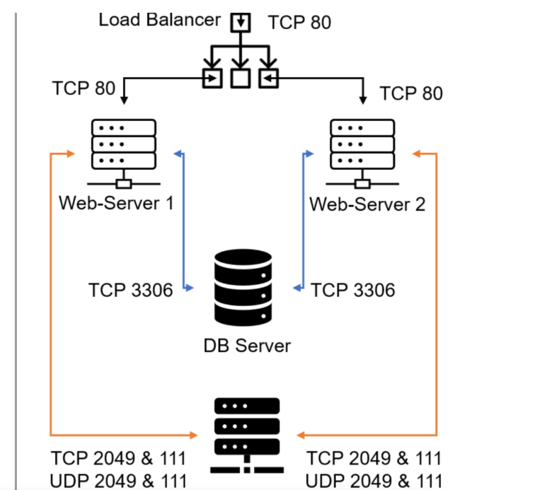

## Task
Deploy and configure an Apache Load Balancer for Tooling Website solution on a separate Ubuntu EC2 instance. Make sure that users can be served by Web servers through the Load Balancer.

## Prerequisites

Ensure that the following servers are installedd and configure already.

- Two RHEL9 Web Servers
- One MySQL DB Server (based on Ubuntu 24.04)
- One RHEL9 NFS Server

## Prerequisites Configurations

- Apache (httpd) is up and running on both Web Servers.
- ```/var/www``` directories of both Web Servers are mounted to ```/mnt/apps``` of the NFS Server.
- All neccessary TCP/UDP ports are opened on Web, DB and NFS Servers.
- Client browsers can access both Web Servers by their Public IP addresses or Public DNS names and can open the ```Tooling Website``` (e.g, ```http://<Public-IP-Address-or-Public-DNS-Name>/index.php```)

# Step 1 - Configure Apache As A Load Balancer

## 1. Create an Ubuntu Server 24.04 EC2 instance and name it Project-8-apache-lb

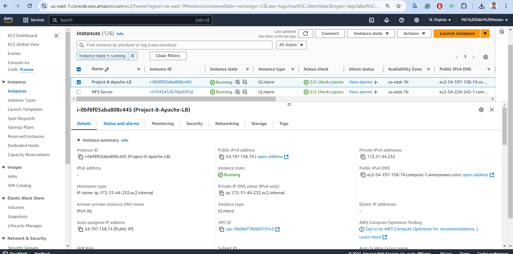

## 2. Open TCP port 80 on Project-8-apache-lb by creating an Inbounb Rule in Security Group

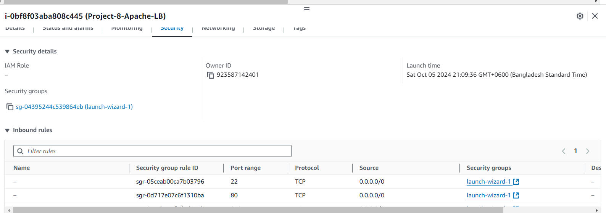

## 3. Instal Apache Load Balancer on Project-8-apache-lb and configure it to point traffic coming to LB to both Web Servers.

### i. Install Apache2

- Access the instance

```bash
ssh -i "my-server-key.pem" ubuntu@54.197.158.74
```
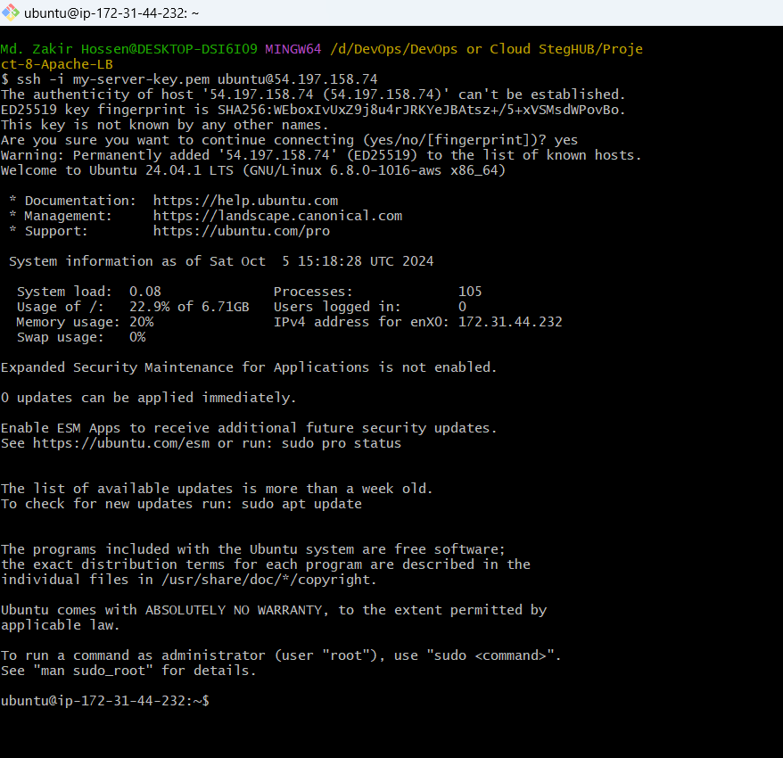

- Update and upgrade Ubuntu

```bash
sudo apt update && sudo apt upgrade -y
```
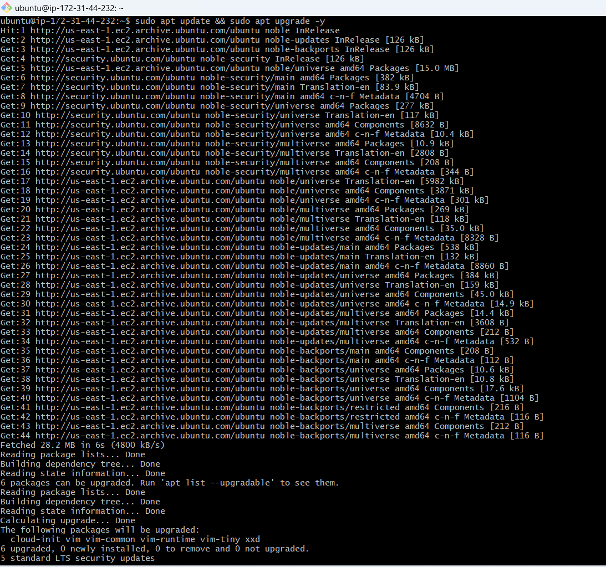

- Install Apache

```bash
sudo apt install apache2 -y
```
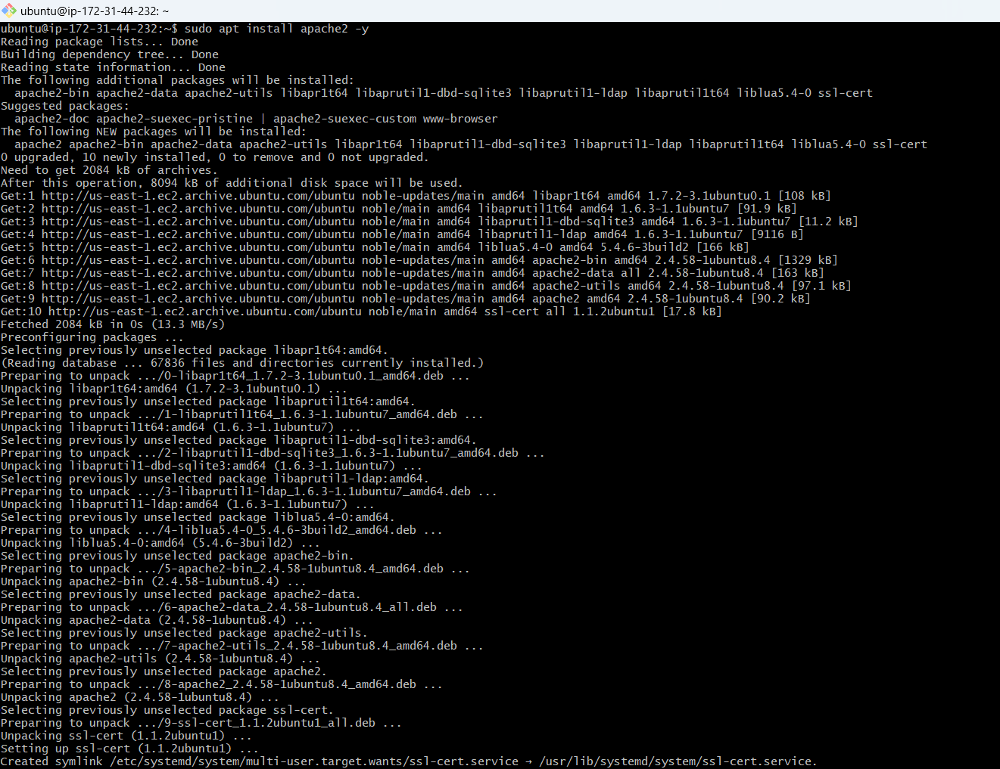

```bash
sudo apt-get install libxml2-dev -y
```
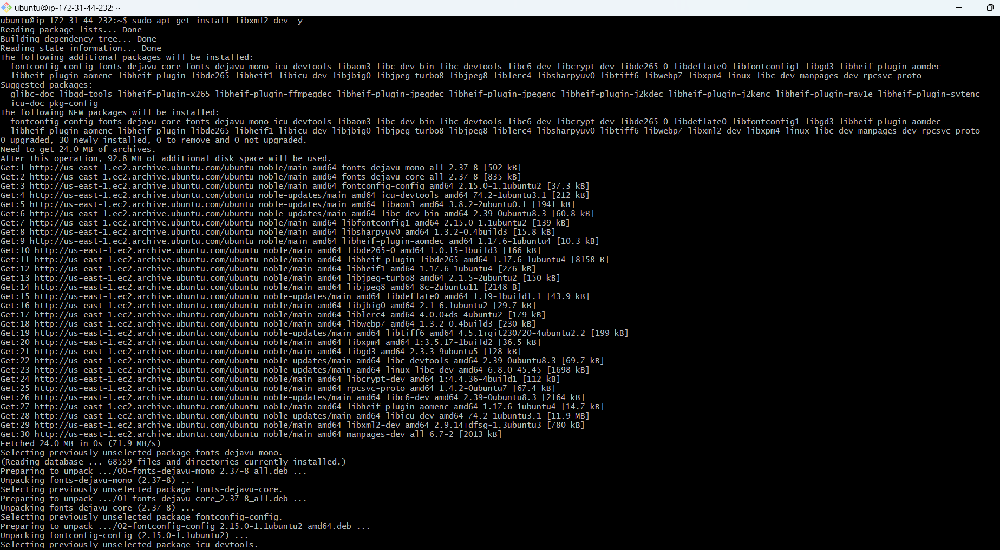

### ii. Enable the following modules

```bash
sudo a2enmod rewrite

sudo a2enmod  proxy

sudo a2enmod  proxy_balancer

sudo a2enmod  proxy_http

sudo a2enmod  headers

sudo a2enmod  lbmethod_bytraffic
```
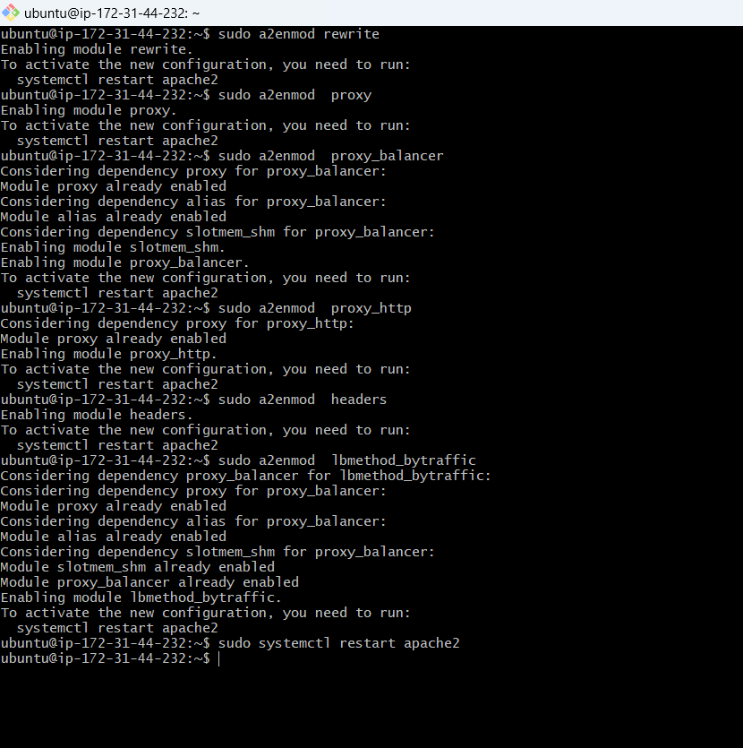

### iii. Restart Apache2 Service

```bash
sudo systemctl restart apache2
sudo systemctl status apache2
```
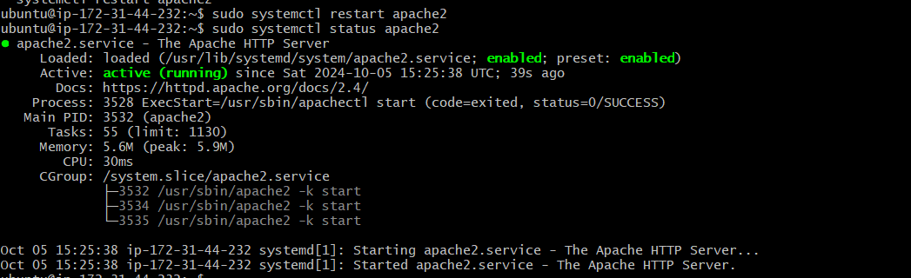

## Configure Load Balancing

### i. Open the file 000-default.conf in sites-available

```bash
sudo vi /etc/apache2/sites-available/000-default.conf
```
### ii. Add this configuration into the section ```<VirtualHost *:80>  </VirtualHost>```

```apache
<Proxy "balancer://mycluster">
            BalancerMember http://18.209.173.19:80 loadfactor=5 timeout=1
           BalancerMember http://54.162.250.21:80 loadfactor=5 timeout=1
           ProxySet lbmethod=bytraffic
</Proxy>


ProxyPreserveHost on
ProxyPass / balancer://mycluster/
ProxyPassReverse / balancer://mycluster/
```
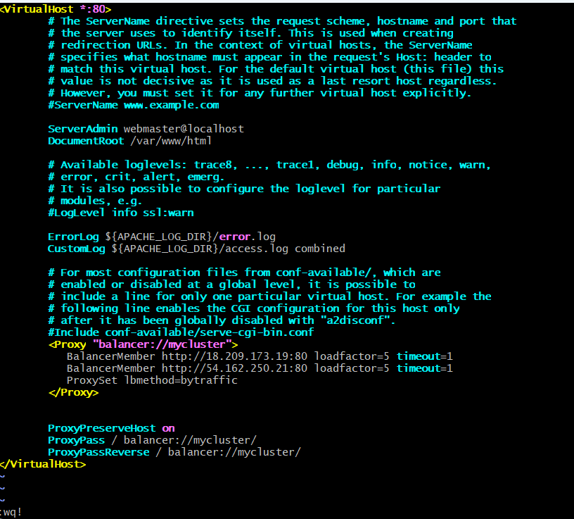

### iii. Restart Apache

```bash
sudo systemctl restart apache2
```
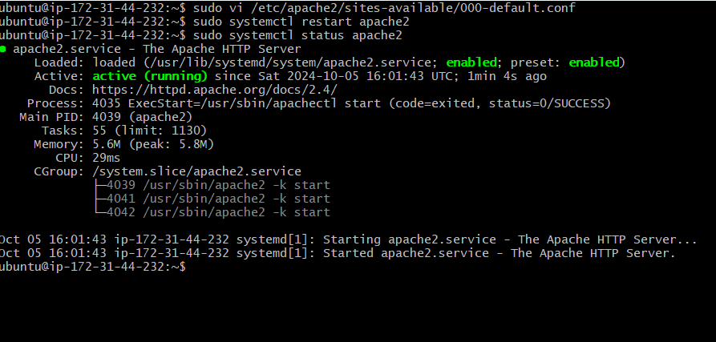

```bytraffic``` balancing method with distribute incoming load between the Web Servers according to currentraffic load. The proportion in which traffic must be distributed can be controlled bt ```loadfactor``` parameter.

Other methods such as ```bybusyness```, ```byrequests```, ```heartbeat``` can also be adopted.


## 4. Verify that the configuration works

### i. Access the website using the LB's Public IP address or the Public DNS name from a browser

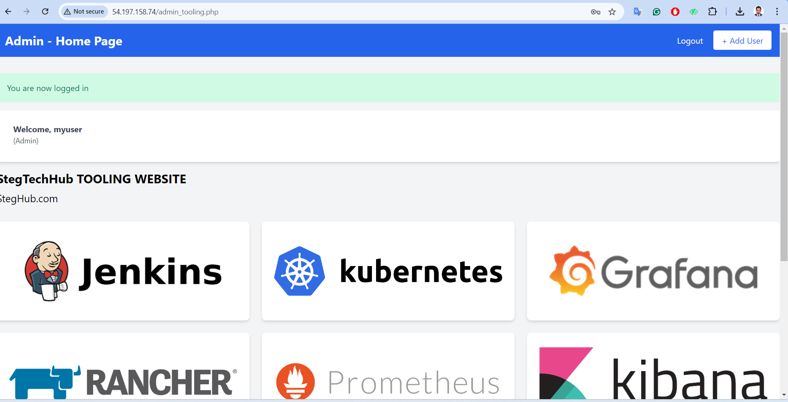
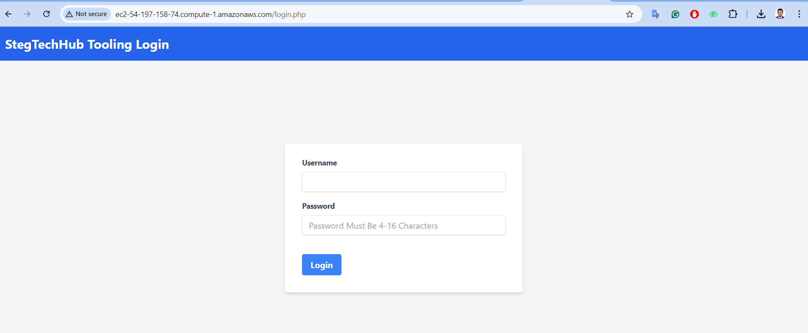

__Note__: If in the previous project, ```/var/log/httpd``` was mounted from the Web Server to the NFS Server, unmount them and ensure that each Web Servers has its own log directory.

### ii. Unmount the NFS directory

- Check if the Web Server's log directory is mounted to NSF

```bash
df -h
sudo umount -f /var/log/httpd
```
If the directory is busy, the services using it needs to be stopped first.

```
sudo systemctl stop httpd
sudo umount -f /var/log/httpd
sudo systemctl start httpd
df -h
sudo systemctl status httpd
```

- Check that the directory is unmounted
```bash
df -h
```
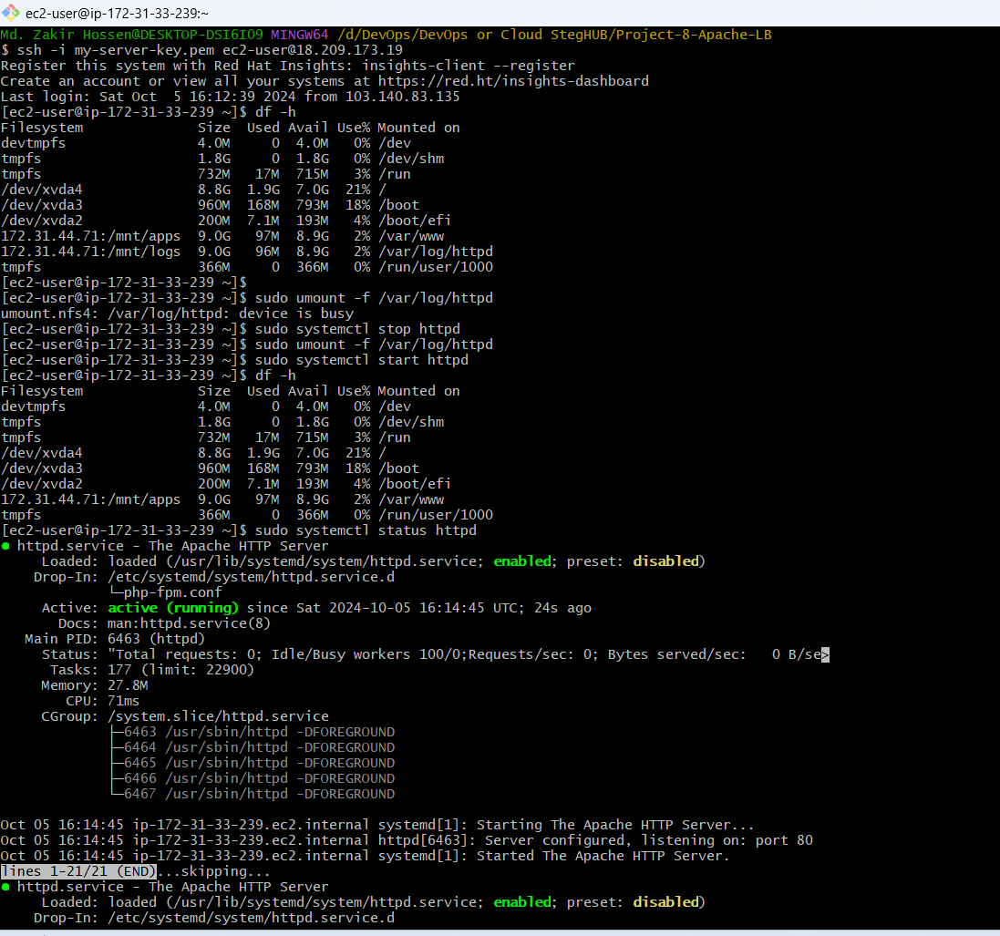

### iii. Open two ssh consoles for both Web Server and run the command:

```bash
sudo tail -f /var/log/httpd/access_log
```
Web Server 1 & 2 ```access_log```
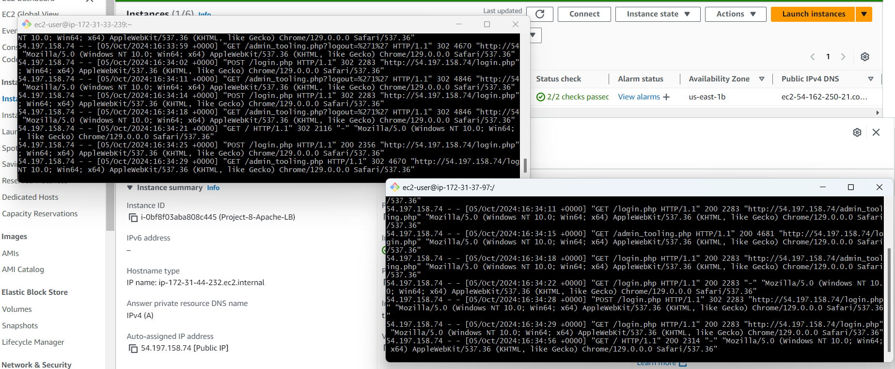


### iv. Refresh the browser page several times and ensure both Web Servers receive HTTP and GET requests. New records must apear in each web server log files. The number of request to each servers will be approximately the same since ```loadfactor``` is set to the same value for both servers. This means that traffic will be evenly distributed between them.

# Note: If `/var/log/httpd/access_log` is missing, follow these steps:
1. **Check Apache config** Custom Log Directory unmount (`CustomLog` directive).
2. **Check Apache config** for the correct log path (`CustomLog` directive).
3. **Create the log directory** if it doesn’t exist: `sudo mkdir -p /var/log/httpd/`.
4. **Verify permissions**: `sudo chown -R apache:apache /var/log/httpd/`.
5. **Restart Apache**: `sudo systemctl restart httpd` or `apache2`.
6. **Check error logs** for any issues: `tail -f /var/log/httpd/error_log`.

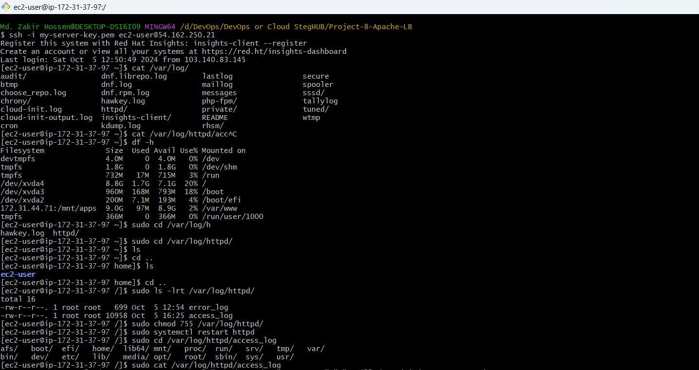

# Optional Step - Configure Local DNS Names Resolution

Sometimes it is tedious to remember and switch between IP addresses, especially if there are lots of servers to manage. It is best to configure local domain name resolution. The easiest way is use ```/etc/hosts``` file, although this approach is not very scalable, but it is very easy to configure and shows the concept well.

## Configure the IP address to domain name mapping for our Load Balancer.

### Open the hosts file

```bash
sudo vi /etc/hosts
```

### Add two records into file with Local IP address and arbitrary name for the Web Servers

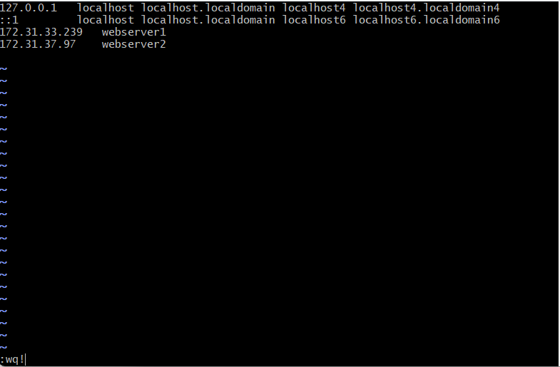

### Update the LB config file with those arbitrary names instead of IP addresses

```bash
sudo vi /etc/apache2/sites-available/000-default.conf
```
```bash
BalancerMember http://webserver1:80 loadfactor=5 timeout=1
BalancerMember http://webserver2:80 loadfactor=5 timeout=1
```
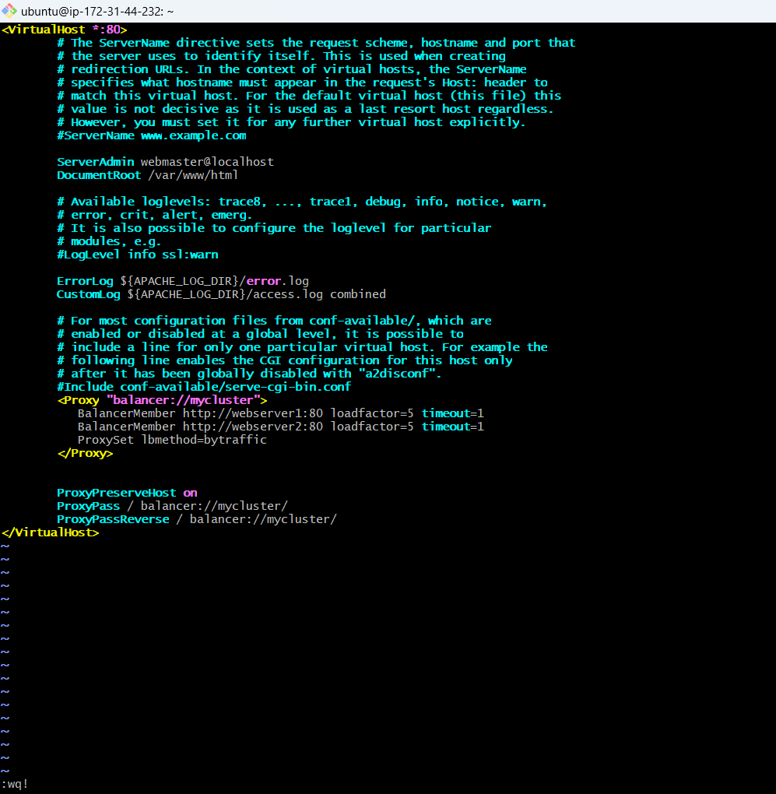


### Try to curl the Web Servers from LB locally

```bash
curl http://webserver1
```
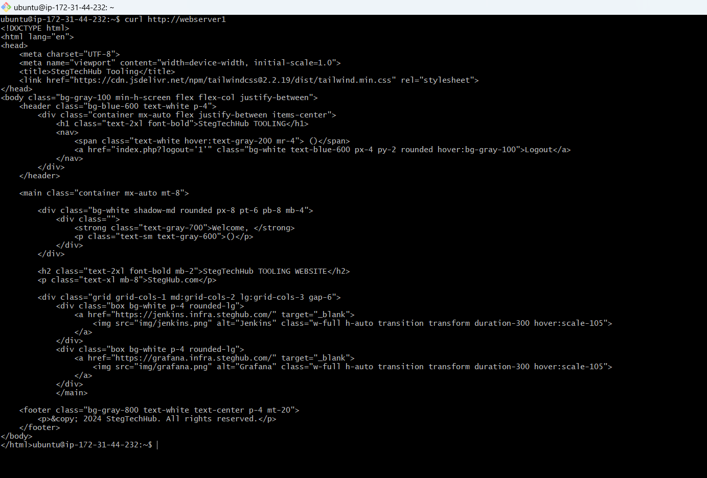

```bash
curl http://webserver2
```
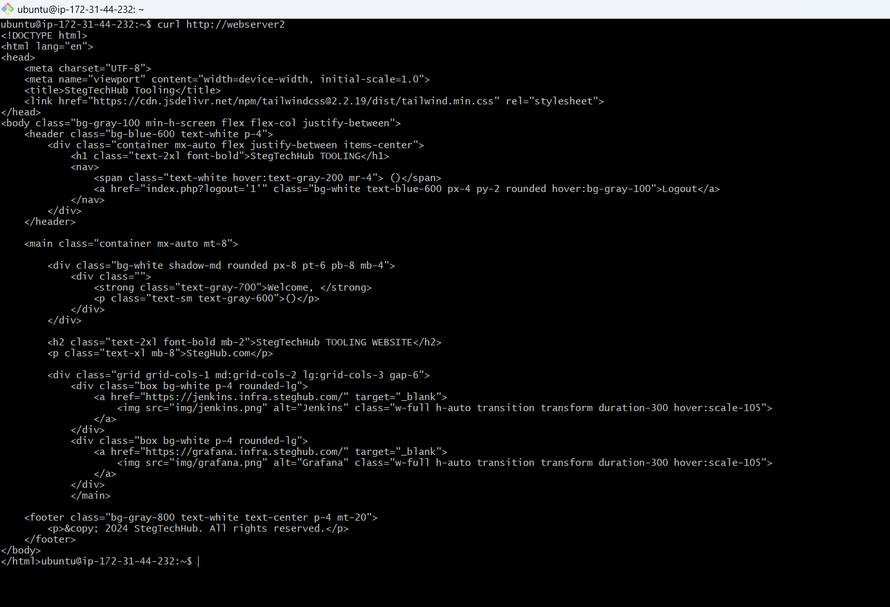


Remember, This is only internal configuration and also local to the LB server, these names will neither be 'resolvable' from other servers internally nor from the Internet.


### Conclusion

The mod_proxy_balancer module in Apache HTTP Server offers robust features for load balancing, including support for sticky sessions, health checks, and various load balancing algorithms. Properly configuring these options ensures high availability, scalability, and reliability for web applications.

